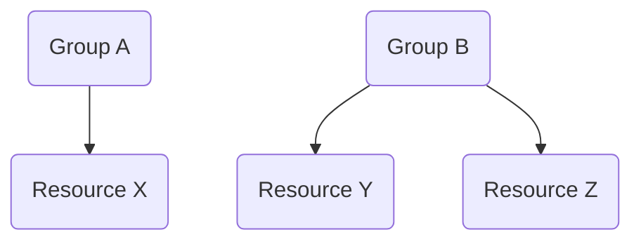

# Authorization

## Group Concept

The bundle has a concept of "groups". Every resource is assigned to a group and those groups don't allow nesting.

## Roles

### General Roles

* `USER`: Users with this role are allowed to access the bundle API

### Group Roles

In the group and resource context there exist three different ROLES:

* `GROUP_READER_METADATA`: If the user has this role he/she can read the metadata of a request and everything attached to it, for the specified group. Metadata mirrors all the information that is also accessible when manually handling physical letters, like information that is printed on a letter and status of the delivery.

* `GROUP_READER_CONTENT`: Allows the user to read the metadata and the content of the all delivery requests in the specified group. In addition to the metadata this also includes the attached documents and the subject line of the delivery. This role implies `GROUP_READER_METADATA`.

* `GROUP_WRITER`: Allows the user to create, change and submit requests for the specified group. This role implies `GROUP_READER_CONTENT` as well as `GROUP_READER_METADATA`.

## Attributes

* `GROUPS`: This attribute needs to contain a list of group IDs that are available for all users.
