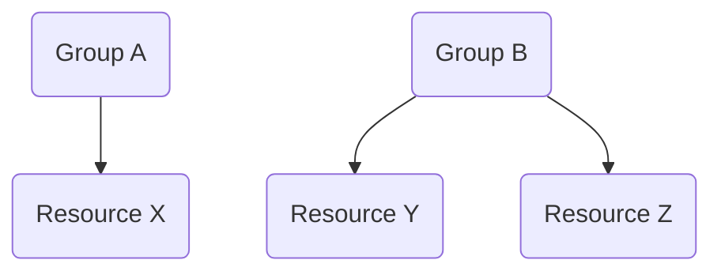

# Authorization

## Group Concept

The bundle has a concept of "groups". Every resource is assigned to a group. There is not group hierarchy, i.e. groups don't allow nesting.

## Resource Metadata and Content

The data and properties of all resources is divided into two categories, "Metadata" and "Content". The general rule of thumb is that everything that a physical postmaster would know about a letter is metadata, everything else is content.

* Metadata example: The destination address, since that would be printed on a physical letter, visible for everyone.
* Content example: The subject line and document attachments, since those would be inside the letter and only visible to the sender and receiver.

## API

In case the user doesn't have the `USER` role then all requests to `/dispatch/*` will fail.

The `/dispatch/groups` endpoint will only return groups to which the user has access to.

The returned `DispatchGroup` resource has as property containing the access rights to any resources that are part of this group:

* `accessRights`: an array of strings
  * `rm`: if the user can read the resource metadata of this group (exists always)
  * `rc`: if the user can read the resource content of this group
  * `w`: if the user can write/create resources in this group

## Roles Configuration

### General Roles

The general expressions only receive the user object and no subject.

* `ROLE_USER`: Users with this role are allowed to access the bundle API

### Group Roles

Each group expression receives a `group` object as a subject, in addition to the user, which only has one method `getIdentifier()` which returns the group identifier for the group this access check applies to.

* `ROLE_GROUP_READER_METADATA`: If the user has this role he/she can read the metadata of a request and everything attached to it, for the specified group. Metadata mirrors all the information that is also accessible when manually handling physical letters, like information that is printed on a letter and status of the delivery.

* `ROLE_GROUP_READER_CONTENT`: Allows the user to read the metadata and the content of the all delivery requests in the specified group. In addition to the metadata this also includes the attached documents and the subject line of the delivery. This role implies `GROUP_READER_METADATA`.

* `ROLE_GROUP_WRITER`: Allows the user to create, change and submit requests for the specified group. This role implies `ROLE_GROUP_READER_CONTENT`.

* `ROLE_GROUP_WRITER_READ_ADDRESS`: This is an extension of the `ROLE_GROUP_WRITER` which also allows reading the recipient address in case it was provided by the system. This role is only needed in case the data quality of the addresses is not guaranteed to be good and a manual review/adjustments may be needed. This role implies `ROLE_GROUP_WRITER`.

## Attributes

* `GROUPS`: This attribute needs to contain an array of group IDs that are available for all users.
