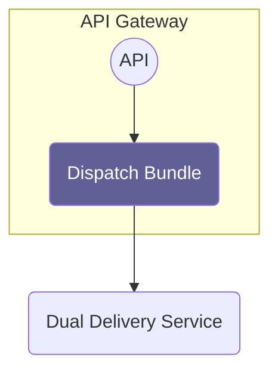

# Overview

Source: https://github.com/digital-blueprint/dbp-relay-dispatch-bundle

This bundle provides an API for managing postal/electronic deliveries which get forwarded to an external "Dual Delivery" service provider.

A client can create delivery requests, attach one or more documents to them, assign one or more recipients and forward these requests to the "dual delivery" service provider. The service provider will then either deliver these documents electronically, if possible, or print the documents and send them postally. Confirmation reports provided by the service provider will be fetched once the documents have been delivered and can be inspected by the user.

Currently, this bundle only supports talking to "Dual Delivery" service providers that implement the ["DuaZSpec" SOAP interface](https://neu.ref.wien.gv.at/at.gv.wien.ref-live/web/reference-server/elkat?p_p_id=20&p_p_lifecycle=0&p_p_state=pop_up&p_p_mode=view&_20_struts_action=%2Fdocument_library%2Fview_file_entry&_20_redirect=https%3A%2F%2Fneu.ref.wien.gv.at%2Fat.gv.wien.ref-live%2Fweb%2Freference-server%2Felkat%3Fp_p_id%3D20%26p_p_lifecycle%3D0%26p_p_state%3Dpop_up%26p_p_mode%3Dview%26_20_redirect%3Dhttps%253A%252F%252Fneu.ref.wien.gv.at%252Fat.gv.wien.ref-live%252Fweb%252Freference-server%252Felkat%253Fp_p_id%253D20%2526p_p_lifecycle%253D0%2526p_p_state%253Dpop_up%2526p_p_mode%253Dview%2526_20_entryEnd%253D20%2526_20_folderStart%253D0%2526_20_struts_action%253D%25252Fdocument_library%25252Fview%2526_20_folderEnd%253D20%2526_20_folderId%253D36087%2526_20_entryStart%253D0%26_20_struts_action%3D%252Fdocument_library%252Fview%26_20_folderId%3D52068&_20_fileEntryId=52150). Since the spec does not specify everything required to talk to a provider, special code is required per spec implementer and included in this bundle as well.

## Installation Requirements

* A MySQL/MariaDB database

## Documentation

* [Configuration](./config.md)
* [Authorization](./authz.md)
* [Database](./database.md)
* [CLI Commands](./cli.md)
